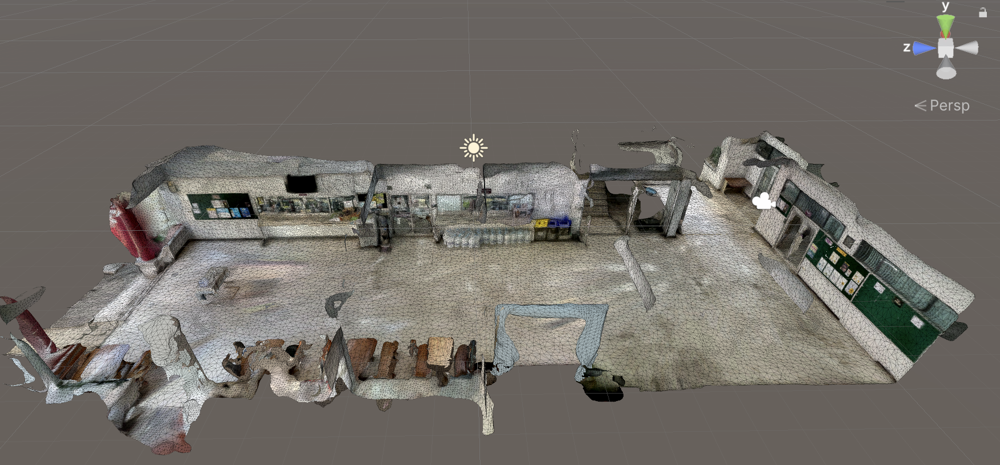

# iNav-polycam2unity-sample

This is a sample project that demonstrates how import a 3D model from Polycam to Unity.

for more information about Polycam, please visit [Polycam to Unity Tutorial](https://www.youtube.com/watch?v=DEbDsxETQuE&t=262s)

## How does it work?

---

note for developers

 
<blockquote>
to render the mermaid diagram, you need to install the mermaid and PlantUML extension in your JetBrains IDE.

